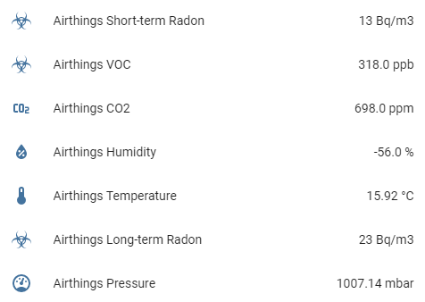

# homeassistant-airthings

This was developed by @gkreitz and forked from (https://github.com/gkreitz/homeassistant-airthings)

I have however changed:

1. the VOC units from ppm to ppb
2. I changed some of the sensors icons (Like Co2, and Radon)



Quick n' dirty hack to get Airthings Wave Plus sensor into Home Assistant. Beware, very untested. Only works with Airthings Wave Plus.

I wanted something to read my Airthings Wave Plus, so I built this. Far from production quality. Magic hardcoded constants. Reads data the wrong way to work around a bug. Tested on a single device. Only supports a single Wave Plus. Does not construct a unique id for the sensor. Figured I may as well upload in case it's useful to someone else.

## Installation
1. Find out the MAC address of your Airthings Wave Plus. See https://airthings.com/us/raspberry-pi/ for how to find MAC address.
1. Put `__init__.py`, `sensor.py`, `manifest.json` into `<config>/custom_components/airthings/` on your home assistant installation (where `<config>` is the directory where your config file resides).
1. Add the following to your `configuration.yaml` (or modify your `sensor` heading, if you already have one):
```yaml
sensor:
  - platform: airthings
    mac: 00:11:22:AA:BB:CC # replace with MAC of your Airthings Wave+
```

Then restart home assistant and if everything works, you'll have some new sensors named `sensor.airthings_{co2,humidity,longterm_radon,pressure,shortterm_radon,temperature,voc}`
